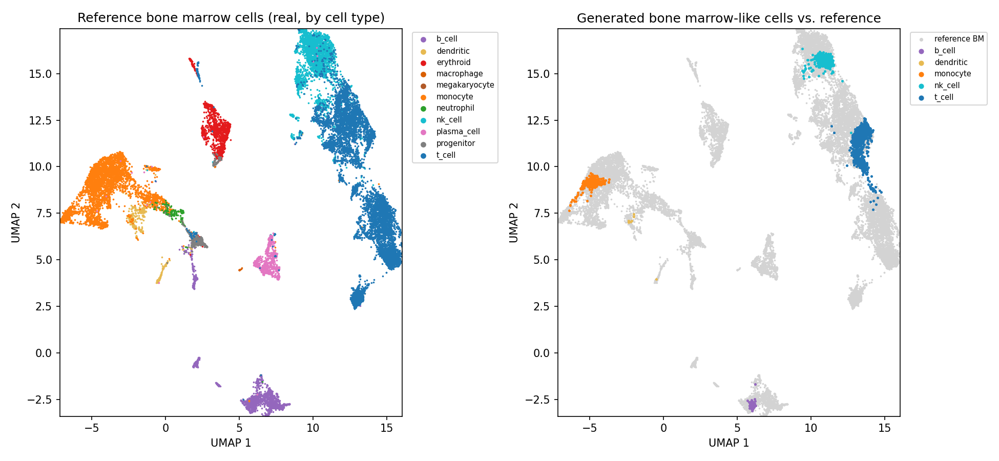

# PRISM

**PR**ogram-conditioned **I**nference of donor-**S**pecific **M**arrow

PRISM infers donor-specific bone marrow (BM) biology from peripheral blood
single-cell RNA-seq data. Bone marrow scRNA-seq is scarce due to technical
and ethical barriers; peripheral blood is accessible and biologically
continuous with marrow — many cell types are shared, and blood carries
latent signatures of marrow biology. PRISM identifies bone marrow-like cells
within a donor's own blood, extracts interpretable transcriptional programs,
and generates donor-specific synthetic BM cells — in contrast to methods
that target population-level realism rather than preserving individual
donor identity.


## Installation

```bash
git clone https://github.com/sunwooj-git/PRISM.git
cd PRISM
pip install -e .
```

Requires Python >=3.10 (scvi-tools' dependency floor). Trained weights
(~225MB) download automatically from PRISM's Zenodo deposit the first time
you call `prism.load_model()`, and are cached under `~/.cache/prism/weights`
(override with the `PRISM_WEIGHTS_DIR` environment variable, or pass
`local_dir=` directly to point at a local copy).

## Quickstart

```python
import anndata as ad
import prism

model = prism.load_model()
adata = ad.read_h5ad("your_blood_data.h5ad")

result = prism.run_inference(model, adata, donor_key="person_id")

donor = next(iter(result.per_donor.values()))
donor.n_bonemarrowlike, donor.n_cells_total          # bone marrow-like cell counts
donor.bonemarrowlike_threshold_percentile            # e.g. 95.0 -- top 5% of blood by marrowness
donor.bonemarrowlike_threshold_zscore                # the raw marrow_z cutoff that percentile is, for this model
donor.celltype_proportions      # Output 1: bone marrow-like cell-type breakdown
donor.program_scores_donor      # Output 2: this donor's P1-P5 program scores (k=5, for stability/interpretability)
donor.generated_adata           # Output 3: 3,000 synthetic bone marrow-like cells
donor.report                    # Output 4: composition + read-count stats + UMAP overlay
prism.print_training_config(model)  # bonus: training hyperparameters
```

A runnable version of this, plus a small synthetic demo dataset, is in
[`examples/`](examples/) — see `examples/quickstart.py` and
`examples/toy_sample.h5ad`.

## Example outputs

Actual outputs from running `examples/quickstart.py` against the toy demo
dataset (9,708 cells, one synthetic donor) — real numbers from a real run,
not illustrative placeholders.

**Output 1 — `celltype_proportions`**: this donor's bone marrow-like
cells' empirical cell-type breakdown. 97 of 9,708 total cells exceeded the
trained reference threshold (top 5% of the *training* blood cohort's
marrowness distribution — not necessarily exactly 5% of any individual
donor's own cells, since the cutoff is fixed against the training
reference, not recomputed per donor). This toy donor is synthetic, built
to statistically resemble a real donor at the per-cell-type level —
composition specifically *within this extreme tail* can still diverge
from what the same real donor would show, since that tail is driven by
individual outlier cells rather than per-type averages. Treat this table
as illustrative of the output format, not a fidelity benchmark.

| cell type | proportion |
|---|---|
| nk_cell | 0.7010 |
| t_cell | 0.1856 |
| monocyte | 0.1031 |
| b_cell | 0.0103 |

**Output 2 — `program_scores_donor`**: this donor's k=5 program readout
(robust/interpretable, independent of generation — see Design notes).

| P1 | P2 | P3 | P4 | P5 |
|---|---|---|---|---|
| 0.287 | 0.172 | 0.309 | 0.167 | 0.271 |

**Output 3 — `generated_adata`**: 3,000 synthetic bone marrow-like cells
× 10,457 genes, raw counts sampled from the trained negative-binomial
decoder (`(3000, 10457)`).

**Output 4 — `report`**: generation's own cell-type composition (a
separate, k-NN retrieval-based estimate — not the same computation as
Output 1) and per-cell-type read-count statistics, plus a UMAP overlay
figure.

| cell type | fraction |
|---|---|
| t_cell | 0.5197 |
| nk_cell | 0.3330 |
| monocyte | 0.1140 |
| b_cell | 0.0310 |
| dendritic | 0.0023 |

| cell type | mean | median | std | count |
|---|---|---|---|---|
| b_cell | 2929 | 2910 | 178 | 93 |
| dendritic | 4343 | 4293 | 169 | 7 |
| monocyte | 2968 | 2963 | 132 | 342 |
| nk_cell | 2770 | 2754 | 169 | 999 |
| t_cell | 2495 | 2468 | 215 | 1559 |



Left: the real reference bone marrow cohort, colored by cell type. Right:
this donor's generated cells (colored) over the same reference (gray) —
generated cells land on the correct real reference clusters for their
assigned type.

## Input requirements

PRISM accepts exactly one input: a blood scRNA-seq `AnnData`.

| Field | Requirement | Notes |
|---|---|---|
| `adata.X` (or a named layer, via `counts_layer=`) | **Raw counts**, not pre-normalized | PRISM applies all required normalization internally (deterministic, no auto-detection). Pre-normalizing first will silently produce wrong marrowness scores and generated output. |
| `adata.var_names` | Gene symbols | Aligned to PRISM's trained ~10,457-gene panel automatically — no manual gene matching needed. Missing panel genes are zero-filled; extra genes are ignored. Overlap is logged (`Found X% reference vars in query data`) during the scVI embedding step; low overlap means more zero-filled genes, so treat results more cautiously in that case. |
| `adata.obs[donor_key]` | A donor identifier column (default name `"person_id"`) | Required. Program scores and generation are computed per donor; multiple donors in one call are handled independently. |
| `adata.obs["celltype_coarse"]` | Optional | If present, used directly (validated against PRISM's trained category set: `b_cell, dendritic, erythroid, macrophage, megakaryocyte, monocyte, neutrophil, nk_cell, plasma_cell, progenitor, t_cell`). If absent, PRISM runs CellTypist (`Immune_All_Low`, majority voting) internally and maps its output onto that same set — you never need to run CellTypist yourself. |
| `adata.obs["total_counts"]` / `"n_counts"` (or pass `library_size_key=`) | Only needed if `adata.X`/`counts_layer` has already been reduced from your full transcriptome (e.g. HVG selection or a targeted panel) | Two cases: (1) `adata.X`/`counts_layer` already holds your full transcriptome — no action needed, PRISM sums it automatically. (2) It's already been reduced to fewer genes — supply the pre-reduction total here (a standard QC metric, e.g. from `sc.pp.calculate_qc_metrics`, often already in `.obs`), since summing the reduced matrix under-counts library size and generated read counts come out proportionally too low (confirmed on real data: ~30-40% low). |

## Repo layout

- **`prism/`** — the installable package (inference only: scVI embedding,
  encoder, NMF program projection, flow + gene decoder generation,
  CellTypist labeling, reporting).
- **`examples/`** — `quickstart.py`, `toy_sample.h5ad` (synthetic single-donor
  demo data).
- **`tests/`** — `test_imports.py` (always runs in CI), `test_quickstart.py`
  (exercises full inference against real weights; skips automatically unless
  `PRISM_WEIGHTS_DIR` is set).
- **`scripts/`** — maintainer-only utilities (`repair_missing_artifacts.py`
  — see its docstring for what it fixed and why, kept for provenance).

Note: trained model weights (~225MB) are not part of this repo — they're
distributed separately via Zenodo and downloaded automatically by
`prism.load_model()` on first use (see Installation above).

## Design notes

- PRISM ships two separate NMF program fits: a k=5 fit used for robust and
  interpretable program readout (Output 2), and a separate k=8 fit used to
  condition generation (Output 3/4). Both are fit on the same encoder
  embeddings, but their program identities are independent — "program 3"
  means different things in each.
- Generated expression is sampled from the trained negative-binomial
  decoder (mean + dispersion), not literally observed counts — realistic in
  distribution, not a real cell.
- The CellTypist fine-to-coarse label mapping (`prism/_celltypist_map.py`'s
  `_build_coarse_map` / `_COARSE_RULES`) is the project's own rule, not
  independently re-verified in this workspace against the exact CellTypist
  version/labels used when the training data was annotated. Its "ILC" rule
  also targets a category (`innate_lymphoid`) outside PRISM's trained 11 —
  any cell landing there is caught by the hard-error check rather than
  silently reaching generation, but review it if ILC cells are common in
  your data.

This repository accompanies a specific publication and is not accepting
external contributions.

## Citation

This work is currently under review. The citation below will be filled in once the associated article is published — please check back then, and refer to the article for detailed information about PRISM.

If you use PRISM, please cite:

```
[paper citation — add on publication]
```

## License

MIT — see [`LICENSE`](LICENSE).
